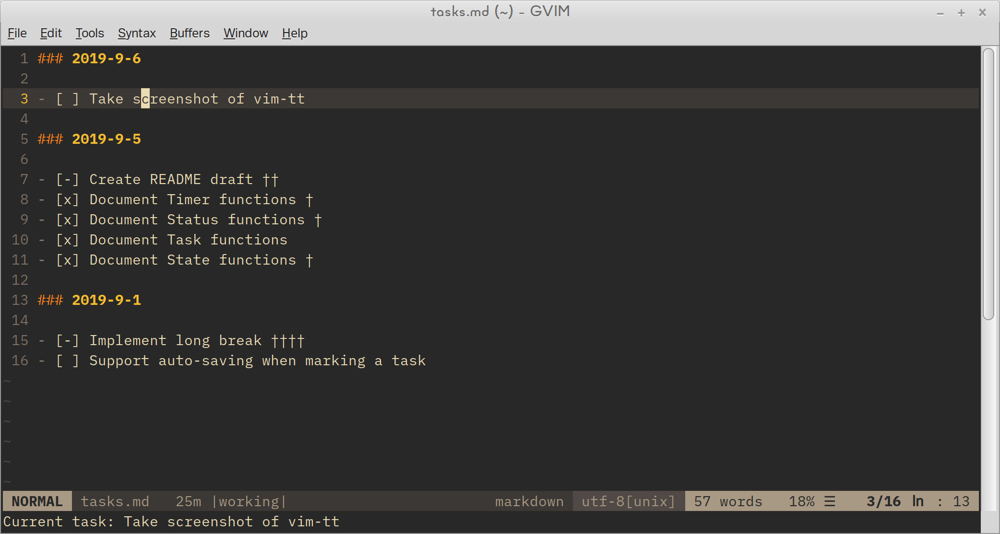
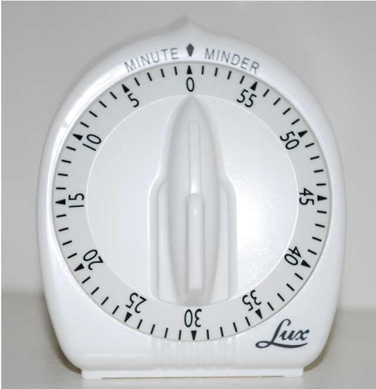

# tt.vim

Task timer for Vim. Exposes the building blocks so you can implement your own task tracking method, whether that is Pomodoro or something of your own creation.



Features at a glance:

- Adds a timer to the status line (requires [vim-airline][vim-airline])
- Audible bell support
- Timer state persists even if you re-start Vim
- Integrates with your existing task list
- Can auto-append a progress mark when the timer finishes
- Configurable duration (and every other setting for that matter!)
- Supports Vim 8 and Neovim

###  Why Vim?

There are dozens of more polished timers out there. Many accessible via a website so you don't even have to install anything. Why try to shoehorn one into your text editor??

Short answer: the task list.

One aspect of the Pomodoro Technique is writing down the tasks you want to work on and then add a checkmark each time you complete a work interval for a given task. Now… many people who use the Pomodoro Technique don't worry about task lists and checkmarks. That is perfectly fine IMO. If that describes you, then you probably won't get much mileage out of tt.vim.

However, if you do like to keep a task list—and you have heard the gospel of Vim—then the idea of being able to maintain your task list using the best *modal* editor on the planet might appeal to you. Doubly so if you are already working in Vim all the time.

Building a task timer in Vim offers one other big advantage—scriptability. It is easy to adopt a "productivity" method and stick with it for a few days. But making it work over the long term? The only time it works for me is when I adapt the system to my circumstances and needs. tt.vim tries to make it possible for you to do that.

## Installing

Use your [favorite plugin manager](https://vi.stackexchange.com/questions/613/how-do-i-install-a-plugin-in-vim-vi). For example, for [vim-plug](https://github.com/junegunn/vim-plug):

```viml
Plug 'mkropat/vim-tt'
```

__Pre-requisite__: To get status line support, you must also have [vim-airline][vim-airline] installed.

If you just want to get started quickly, add the following to your `.vimrc` and restart Vim:

```viml
let g:tt_use_defaults = 1
```

See [defaults](#defaults) for usage details.

## API Reference

### Timer Management

tt.vim exposes a single timer that counts down to 0 from however many minutes and seconds you set it to start at.



| Function                    | Description                                                       |
| --------------------------- | ----------------------------------------------------------------- |
| `tt#set_timer(duration)`    | Set the remaining duration. See [duration format](#durationf-romat) for valid formats. |
| `tt#start_timer()`          | Starts counting down the remaining duration. |
| `tt#pause_timer()`          | Stops counting down the remaining duration. |
| `tt#toggle_timer()`         | Start the timer if paused, otherwise pause it. |
| `tt#clear_timer()`          | Reset the timer back to the initial state. |
| `tt#when_done(command)`     | Register an ex command to be run when the timer reaches 0. The command will be run at most once per `when_done` call. If you call `when_done` again, the new command will replace any previous commands. |

<a name="duration-format"></a>

#### Duration Format

When calling `tt#set_timer(duration)`, any of the following formats are supported.

| Duration      | Interpretation  |
| ------------- | --------------- |
| `30`          | 30 minutes      |
| `'30'`        | 30 minutes      |
| `'30m'`       | 30 minutes      |
| `'30:00'`     | 30 minutes      |
| `'00:30:00'`  | 30 minutes      |
| `'123:03:21'` | 123 hours, 3 minutes, 21 seconds  |
| `'00:30'`     | 30 seconds      |
| `'30s'`       | 30 seconds      |
| `'30h'`       | 30 hours        |

### Timer Queries

| Function                          | Description                                                       |
| --------------------------------- | ----------------------------------------------------------------- |
| `tt#is_running()`                 | Returns 0 if the timer is paused (or not started), 1 otherwise. |
| `tt#get_remaining()`              | Returns the number of seconds remaining on the current timer. |
| `tt#get_remaining_full_format()`  | Returns the remaining duration in [HH:mm:ss] format. |
| `tt#get_remaining_smart_format()` | Returns the remaining duration in a format that depends on the current state. |

### Status

The status field represents what the current timer is for. Are you "working"? On a "break"? Taking a "long break"? Use the status field to capture that type of info.

| Function                    | Description                                                       |
| --------------------------- | ----------------------------------------------------------------- |
| `tt#get_status()`           | Return the value that was last set using `set_status`             |
| `tt#get_status_formatted()` | Return the status for use in the UI, such as in the status line   |
| `tt#set_status(status)`     | Set a new status                                                  |
| `tt#clear_status()`         | Reset the status back to the initial empty state                  |

### Tasks

Optionally, you can set a task, which is a free-form text string. It can be used to note what specifically you are working on.

tt.vim also has the concept of a task file. The task file is meant to be a single text file where you list out any tasks that you want to work on. The text file can (in theory) be in any file format, so long as each task is on its own line.

| Function                        | Description                                                       |
| ------------------------------- | ----------------------------------------------------------------- |
| `tt#get_task()`                 | Return the text that was last set using `set_task`                |
| `tt#set_task(text, [line_num])` | Set `text` as the current task. If `line_num` is passed and `text` represents that entire line, then `mark_last_task` is able to be used. |
| `tt#clear_task()`               | Removes the current task.                                         |
| `tt#open_tasks()`               | Open a window showing the `g:tt_taskfile` file.                   |
| `tt#focus_tasks()`              | Focus the window opened by `open_tasks`.                          |
| `tt#can_be_task(text)`          | Returns 1 if `text` is a markable task, 0 otherwise.              |
| `tt#mark_task()`                | Appends a `g:tt_progressmark` character to the current line. Accepts a Vim range to mark multiple lines at the same time. |
| `tt#mark_last_task()`           | Instead of appending `g:tt_progressmark` to the current line, append it to the line/`line_num` passed to `set_task`. It should be smart enough to mark the right line, even if you added/removed lines in the meanwhile. |

### State

To help support advanced workflows, tt.vim exposes a general mechanism for storing custom data. You don't have to use it—you can always use Vim variables instead. However, the advantage of using these functions is that any data stored will persist and be available when you restart Vim, just like tt.vim's builtin state.

| Function                      | Description                                                           |
| ----------------------------- | --------------------------------------------------------------------- |
| `tt#get_state(key, default)`  | Return the value for `key`. If not present, return `default` instead. |
| `tt#set_state(key, value)`    | Store a value at `key`. The value must be serializable by Vim's `string()` function. |

### Misc

| Function                      | Description                                                       |
| ----------------------------- | ----------------------------------------------------------------- |
| `tt#play_sound()`             | Play an audible bell sound. Configurable with `g:tt_soundfile`. Supports OS X. Requires `has('pythonx')` on Windows. Requires `aplay(1)` on Linux. |

## Settings

| Setting             | Default           | Description                                             |
| ------------------- | ----------------- | ------------------------------------------------------- |
| `g:tt_progressmark` | `†`               | The character to append to a line when calling `tt#mark_task()`
| `g:tt_soundfile`    | `bell.wav`        | The sound file to play when calling `tt#play_sound()`. `.wav` files should work on all platforms. Other formats may be supported on your specific platform.
| `g:tt_statefile`    | `VIMDIR/tt.state` | Where tt.vim stores its state, so that when you restart Vim everything resumes where you left off.
| `g:tt_taskfile`     | `~/tasks`         | The file to open when calling `tt#open_tasks()`, etc.
| `g:tt_use_defaults` | &lt;empty&gt;     | If set to `1`, get the pre-defined commands and key bindings (see [defaults](#defaults))

Settings can be overridden in your `~/.vimrc` file. For, example to enable `g:tt_use_defaults`, you would add the following line:

```viml
let g:tt_use_defaults = 1
```

<a name="defaults"></a>

## Defaults

If you enable `g:tt_use_defaults` you will get the following commands and key mappings. If it works for you, great. If not, feel free to copy this set up as a starting point and tweak it as you see fit.

```viml
command! Work
  \  call tt#set_timer(25)
  \| call tt#start_timer()
  \| call tt#set_status('working')
  \| call tt#when_done('AfterWork')

command! AfterWork
  \  call tt#play_sound()
  \| call tt#open_tasks()
  \| Break

command! WorkOnTask
  \  if tt#can_be_task(getline('.'))
  \|   call tt#set_task(getline('.'), line('.'))
  \|   execute 'Work'
  \|   echomsg "Current task: " . tt#get_task()
  \|   call tt#when_done('AfterWorkOnTask')
  \| endif

command! AfterWorkOnTask
  \  call tt#play_sound()
  \| call tt#open_tasks()
  \| call tt#mark_last_task()
  \| Break

command! Break call Break()
function! Break()
  let l:count = tt#get_state('break-count', 0)
  if l:count >= 3
    call tt#set_timer(15)
    call tt#set_status('long break')
    call tt#set_state('break-count', 0)
  else
    call tt#set_timer(5)
    call tt#set_status('break')
    call tt#set_state('break-count', l:count + 1)
  endif
  call tt#start_timer()
  call tt#clear_task()
  call tt#when_done('AfterBreak')
endfunction

command! AfterBreak
  \  call tt#play_sound()
  \| call tt#set_status('ready')
  \| call tt#clear_timer()

command! ClearTimer
  \  call tt#clear_status()
  \| call tt#clear_task()
  \| call tt#clear_timer()

command! -range MarkTask <line1>,<line2>call tt#mark_task()
command! OpenTasks call tt#open_tasks() <Bar> call tt#focus_tasks()
command! -nargs=1 SetTimer call tt#set_timer(<f-args>)
command! ShowTimer echomsg tt#get_remaining_full_format() . " " . tt#get_status_formatted() . " " . tt#get_task()
command! ToggleTimer call tt#toggle_timer()

nnoremap <Leader>tb :Break<cr>
nnoremap <Leader>tm :MarkTask<cr>
xnoremap <Leader>tm :MarkTask<cr>
nnoremap <Leader>tp :ToggleTimer<cr>
nnoremap <Leader>ts :ShowTimer<cr>
nnoremap <Leader>tt :OpenTasks<cr>
nnoremap <Leader>tw :Work<cr>
```

## Limitations

### Multiple Vim Processes

tt.vim behaves badly if you have multiple Vim processes running simultaneously. Any `tt#when_done()` hooks will get run in all open processes. This often manifests as `tt#play_sound()` getting called in quick succession, or the last task being marked more than once.

I am not aware of an easy way to prevent this, while still allowing `tt#when_done()` hooks to fire even after Vim is closed and re-opened. Suggestions are welcome.

### What else?

Were you surprised about something? Let us know by submitting a PR or an issue.

[vim-airline]: https://github.com/vim-airline/vim-airline

## Credits

- [Bell sound](http://soundbible.com/1531-Temple-Bell.html) is by Mike Koenig ([license](https://creativecommons.org/licenses/by/3.0/))
- [Timer photo](https://commons.wikimedia.org/wiki/File:Lux_Products_Long_Ring_Timer.jpg) is by Dennis Murphy (public domain)
